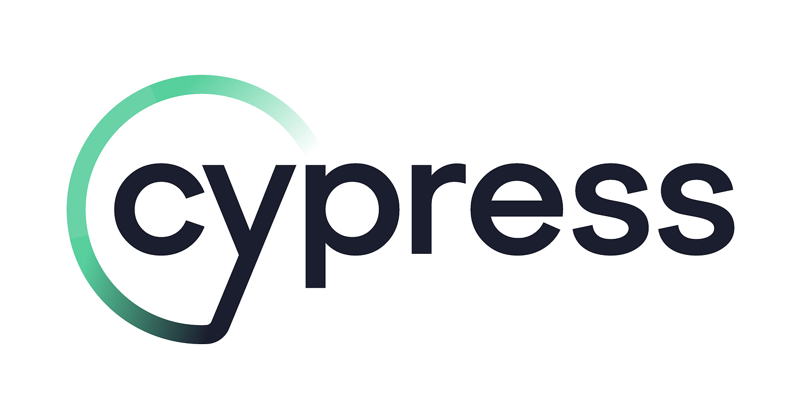

# Estudos em Cypress  

  

📌 **Estudos em Cypress**  
Este repositório é dedicado ao meu aprendizado e prática com **Cypress**, uma poderosa ferramenta de teste end-to-end para aplicações web modernas. Aqui, você encontrará exemplos de testes, boas práticas e experimentos que desenvolvi ao longo do meu progresso no domínio desta tecnologia.

---

## ✨ O que você encontrará aqui  
- Casos de teste automatizados para fluxos comuns de aplicações web.  
- Exemplos de como usar seletores dinâmicos e boas práticas de escrita de testes.  
- Integração com ferramentas como CI/CD e relatórios de execução.  
- Dicas e insights adquiridos ao longo do aprendizado.  

---

## 🚀 Objetivo do repositório  
Meu objetivo principal é consolidar os conhecimentos em Cypress, aprimorar habilidades em automação de testes e criar uma base sólida para futuros projetos na área de Qualidade de Software.

---

## 🛠️ Tecnologias utilizadas  
- **Cypress**: Framework principal para automação de testes.  
- **Node.js**: Gerenciamento de dependências e execução do projeto.  
- **Outras Ferramentas**: ESLint, Prettier, etc.  

---

## 💡 Como contribuir  
Feedbacks e sugestões são bem-vindos! Sinta-se à vontade para explorar o conteúdo, abrir issues ou criar pull requests.

---

**Explore o repositório e acompanhe minha jornada no universo do Cypress! 🚀**

